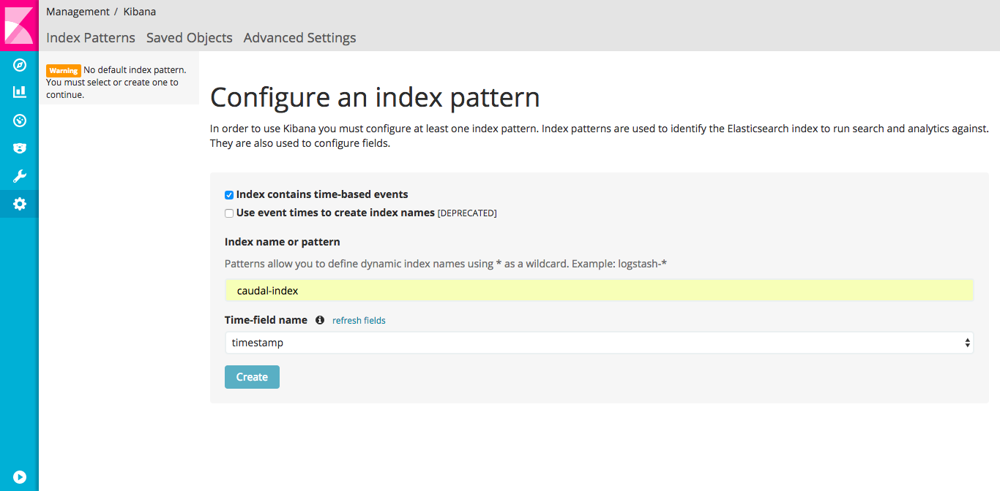
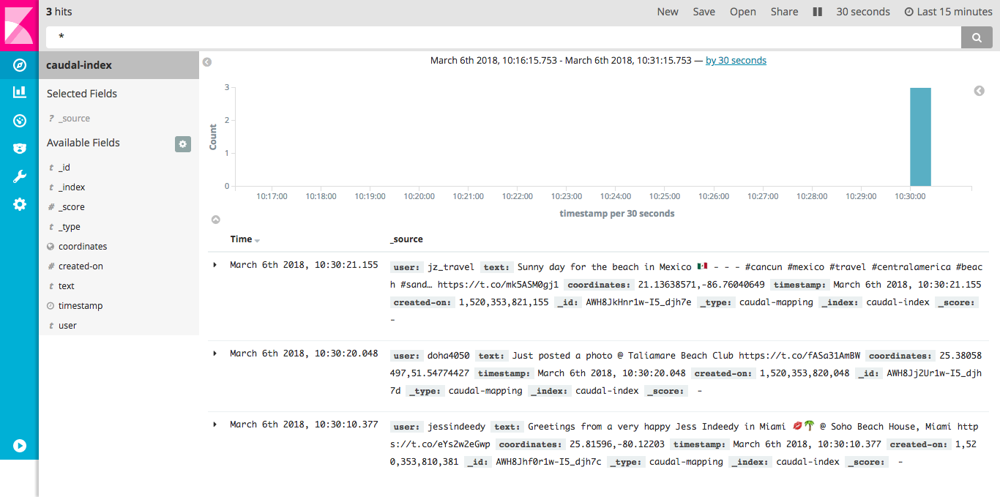
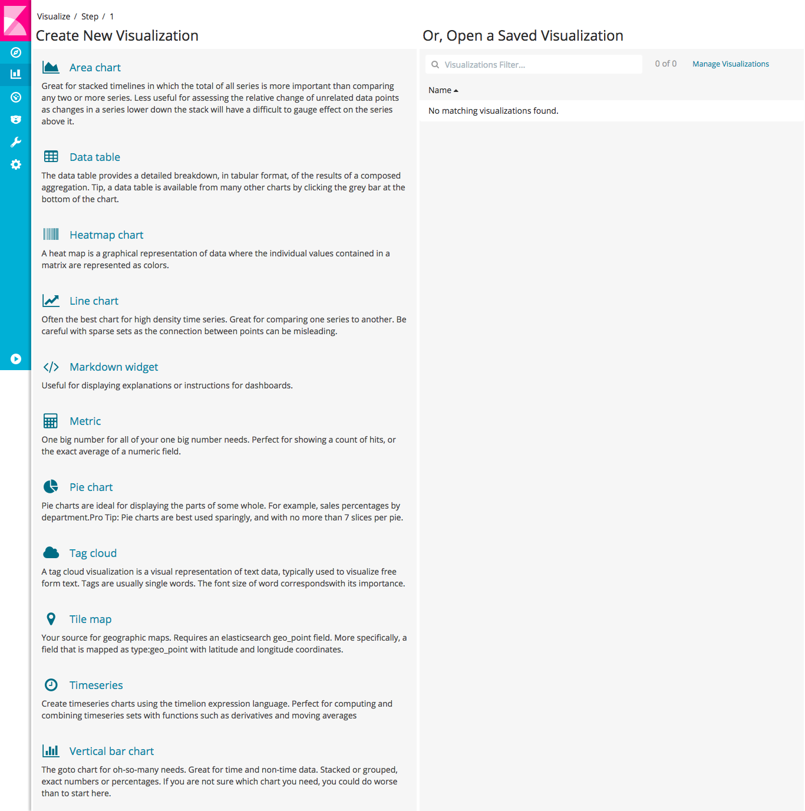
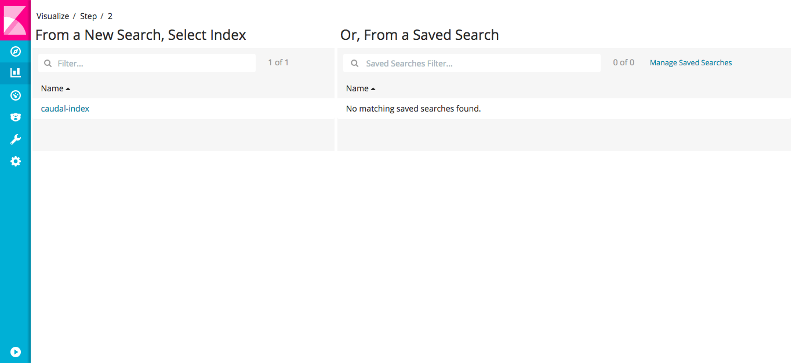
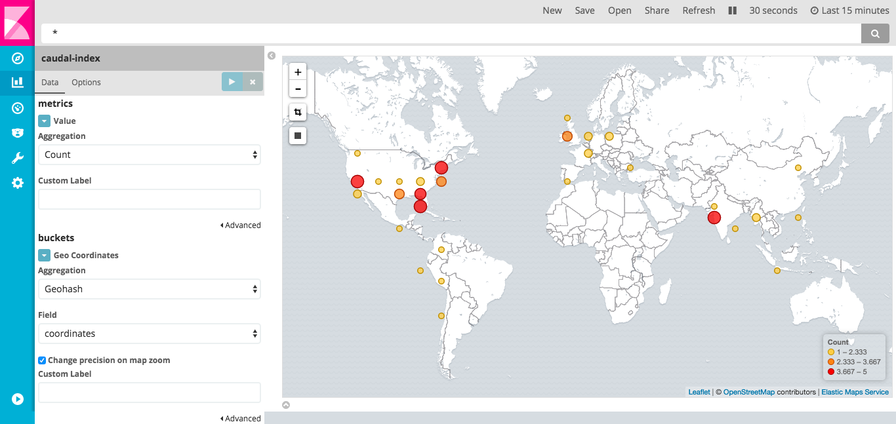
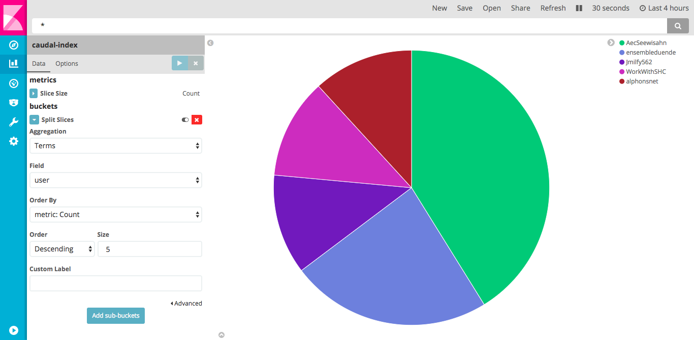
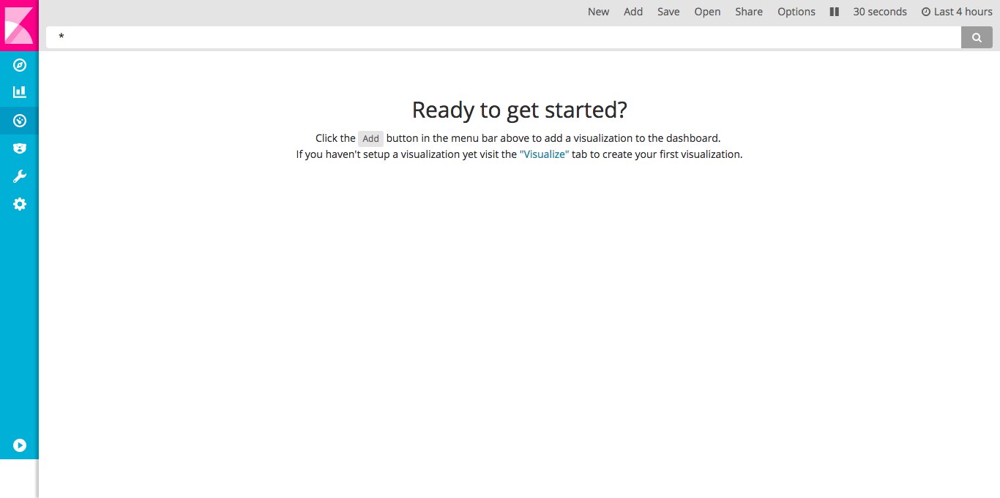
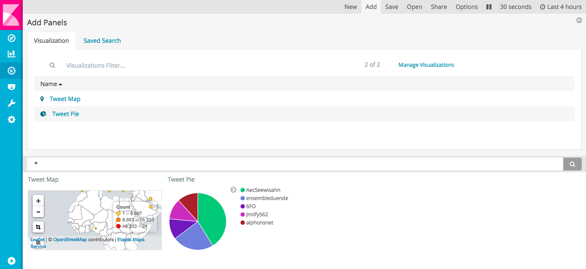
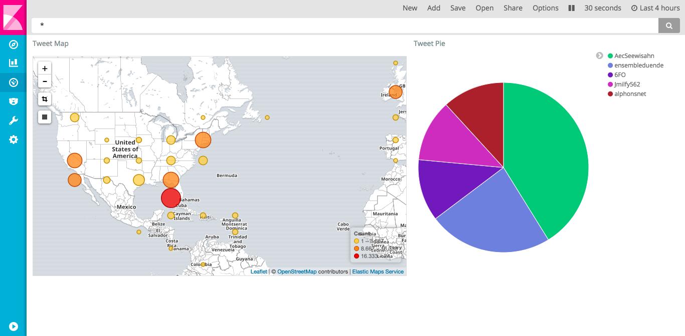
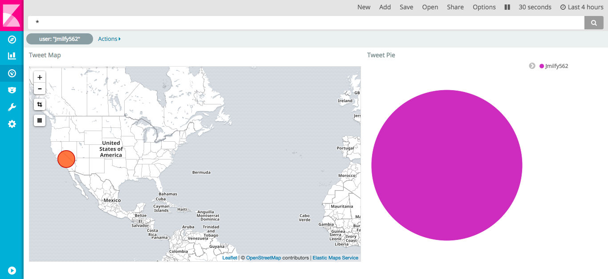

title: Lab 5 - Integration
---

Caudal offers integration with a wide set of tools.

## Requirements
 * [Listeners](lab1.html)
 * [Streamers](lab3.html)


## Elasticsearch

Caudal, as an in-memory streaming processor, does not have an internal mechanism to store events atomically. Elasticsearch could be util in scenarios where we need to search and extract historical reports.

Next, we propose an exercise to push extracted events from Twitter to Elasticsearch, and extract reports through Kibana:


### Configuration

Write following configuration in `config/` directory, and enjoy comments:

```clojure config/twitter-elastic.clj
;; Requires
(ns caudal.example.tcp
  (:require
   [mx.interware.caudal.io.elastic :refer :all]
   [mx.interware.caudal.io.rest-server :refer :all]
   [mx.interware.caudal.streams.common :refer :all]
   [mx.interware.caudal.streams.stateful :refer :all]
   [mx.interware.caudal.streams.stateless :refer :all]))

;; Listeners
(deflistener twitter [{:type       'mx.interware.caudal.io.twitter
                       :parameters {:name            "MyCaudalExample"
                                    :consumer-key    "CoNsuMerKey"     
                                    :consumer-secret "CoNsUmErSeCrEt"
                                    :token           "00000000-AcCeSsToKeN"
                                    :token-secret    "AcCeSsToKeNsEcReT"
                                    :terms           ["selfie" "beach" "travel"]}}])

;; Prune a lot of data of incoming twitter event
;; Search for tweets with geolocation enabled and not replies or quotes
(defn prune-data [event]
  (let [{:keys [coordinates user text in_reply_to_screen_name is_quote_status in_reply_to_status_id_str]} event
        [lat lon] (:coordinates coordinates)]
    (if-not (and in_reply_to_screen_name is_quote_status in_reply_to_status_id_str)
      (if coordinates
        {:user (:screen_name user)
         :text text
         :coordinates (str lat "," lon)}
        (clojure.tools.logging/warn {:prune "no coordinates"}))
      (clojure.tools.logging/warn {:prune "reply"}))))

;; Sinks
(let [es-url          "http://localhost:9200"   ;; elasticsearch url
      es-mapping-name "caudal-mapping"          ;; mapping name
      es-index-name   "caudal-index"            ;; index name
      es-mapping      {es-mapping-name {:properties {:user        {:type "string" :index "not_analyzed"} ;; Does not analize :user
                                                     :timestamp   {:type "date" :format "epoch_millis"}  ;; Takes :timestamp in millis
                                                     :coordinates {:type "geo_point"}                    ;; Takes :coordinates as lat,lon
                                                     }}}
      es-store-fn        (elastic-store! [es-url es-index-name es-mapping-name es-mapping {}])]
  (defsink example 1 ;; backpressure
    (smap [prune-data]
          (->INFO [:all]
                  es-store-fn))))

;; Wire
(wire [twitter] [example])
```

Download and start Elasticsearch before to start Caudal:
```
$ wget https://artifacts.elastic.co/downloads/elasticsearch/elasticsearch-5.2.2.tar.gz
$ tar xzvf elasticsearch-5.2.2.tar.gz
$ cd elasticsearch-5.2.2
$ bin/elasticsearch
```

Check connectivity to port `9200` of Elasticsearch using curl:
```
$ curl http://localhost:9200
{
  "name" : "bdbqlra",
  "cluster_name" : "elasticsearch",
  "cluster_uuid" : "hjpH9C0USPOiSno8b2yNqA",
  "version" : {
    "number" : "5.2.2",
    "build_hash" : "f9d9b74",
    "build_date" : "2017-02-24T17:26:45.835Z",
    "build_snapshot" : false,
    "lucene_version" : "6.4.1"
  },
  "tagline" : "You Know, for Search"
}
```

Start Caudal passing configuration file:
```
$ bin/caudal -c config/twitter-elastic.clj start
```

Verifying Elasticsearch contents:

```
$ curl -XPOST 'localhost:9200/caudal-index/_search?pretty' -d '{"query": { "match_all": {} }}'
```

## Kibana

In order to create visualizations and reports, we need to install and run Kibana:
```
$ wget https://artifacts.elastic.co/downloads/kibana/kibana-5.2.2-linux-x86_64.tar.gz
$ tar xzvf kibana-5.2.2-linux-x86_64
$ cd kibana-5.2.2-darwin-x86_64/
$ bin/kibana
```

Open url [http://localhost:5601](http://localhost:5601) in a browser and click on **Settings**.

In `Configure an index pattern` screen put as index `caudal-index` and select `timestamp` as Time-field name, then click in `Create`:



Now, click Discovery button (on top of sidebar), you should be a Timeline with incoming events:



### Visualizations

#### Tile map

Creating a visualization for events is quite easy, in sidebar click Visualization. In this screen, search in column `Create new Visualization` for `Tile map` and click:



In `Step 2` select `caudal-index` in column `From a New Search, Select Index`:




In Tile map screen, in Data Options, click `Geo coordinates`. Select `Geohash` aggregation and `coordinates` as field. Now click in Play button and map is updated with cluster points by geolocated tweet:



Save your visualization using Save button.

#### Pie chart

Click Visualize button until you can see `Create new Visualization`, then search for `Pie chart`. Again in `Step 2` select `caudal-index` in column `From a New Search, Select Index`. 

In Pie chart screen, Click `Split Slices` using `Terms` as aggregation and `user` as field. This pie shows top five tweeters:



Save your pie using Save button.

#### Dashboards

Kibana provides Dashboards as a mechanism to group several visualizations in a single screen.

Click on Dashboard button on sidebar:



Click `Add` button to select visualizations saved previously:



You can add visualization to screen and customize it size and order:



Clicks and selections in a single visualization filter data in all the others:


